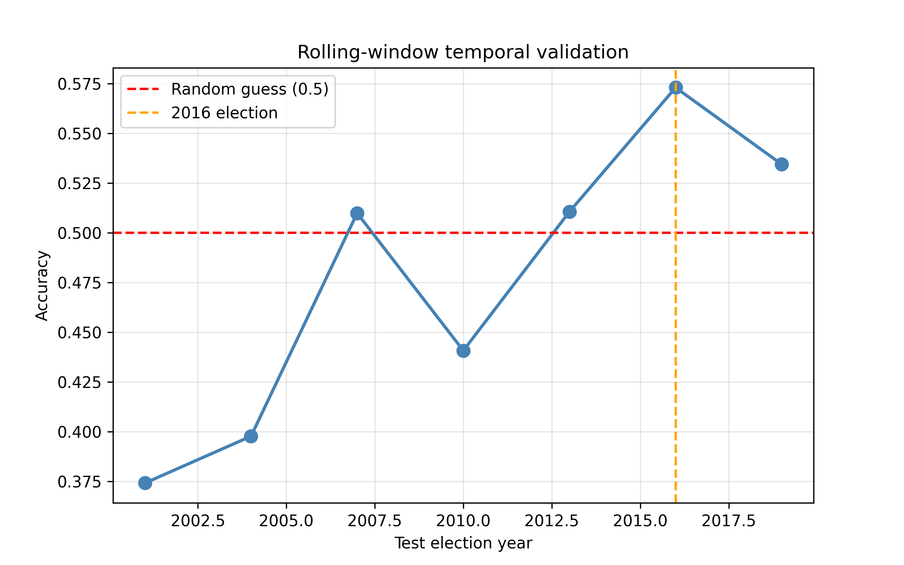
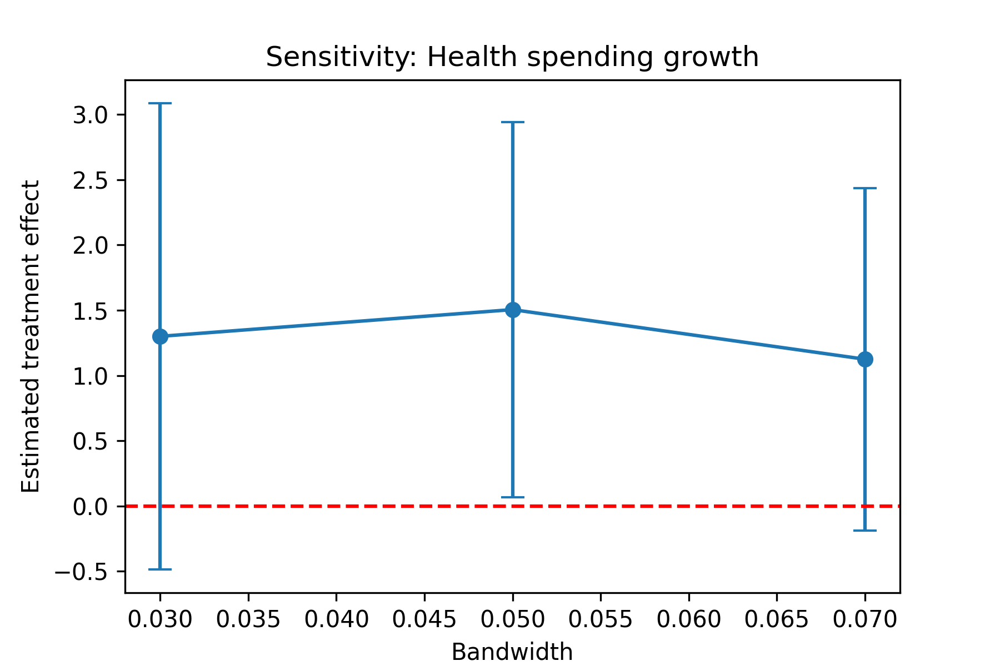

# Fiscal Accountability or Regime Shift?  
### Machine Learning and Causal Evidence from Philippine Gubernatorial Elections (1992–2022)

[]()
[](https://opensource.org/licenses/MIT)
[]()

**Author:** Jemar John J. Lumingkit  
**Affiliation:** Mindanao State University – Iligan Institute of Technology  
**Contact:** [jemar.lumingkit@g.msuiit.edu.ph](mailto:jemar.lumingkit@g.msuiit.edu.ph)  
**Conference:** 2nd International Conference on the UN SDGs and Social Innovation (ICUNSSI 2026)

---

## 📌 Overview

This repository contains the complete replication package for the paper:

> *Fiscal Accountability or Regime Shift? Machine Learning and Causal Evidence from Philippine Gubernatorial Elections (1992–2022)*

Using a 30‑year panel of Philippine provinces, an **XGBoost classifier** with **SHAP** feature attribution, and a **regression discontinuity design (RDD)**, we show that:

- High within‑sample accuracy (95.5%) **masks a complete temporal generalisation failure**.
- Rolling‑window validation yields out‑of‑sample accuracy of only **37–57%** – barely above random guessing.
- Predictive performance collapses sharply after the **2016 Duterte presidential transition**, indicating a **regime shift** in local accountability.
- The **dynasty–IRA dependence interaction** is the most important predictor, supporting **clientelism** over programmatic accountability.
- Winning a close election **causally increases subsequent health spending** (ATE ≈ 1.5 p.p.), consistent with a **virtuous cycle** of incumbency and fiscal effort.

**Main methodological contribution:** Temporal validation is not optional – it is a minimum standard for non‑stationary political panel data.

---

## 🔍 Key Findings (At a Glance)

| Finding | Detail |
|---------|--------|
| Within‑sample accuracy (5‑fold CV) | 95.5% (AUC = 0.984) |
| Out‑of‑sample (rolling window) | 37.4% – 57.3% (≤ random guessing) |
| Post‑2016 aggregated accuracy | 49.4% (worse than coin flip) |
| Dominant predictor | `dynasty × ira_share` (clientelistic) |
| Public welfare spending rank | 2nd most important |
| Health spending rank | 4th most important |
| RDD effect on health spending | +1.50 p.p. at 5% bandwidth (95% CI [0.07, 2.94]) |
| McCrary test for manipulation | p = 0.884 → no evidence of vote‑margin manipulation |

---

## 🧪 Methodology

### Predictive Model
- **Algorithm:** XGBoost (200 estimators, max depth 5, lr=0.05)
- **Evaluation:** 5‑fold stratified cross‑validation *vs.* rolling‑window temporal validation
- **Interpretability:** SHAP (mean absolute values) + partial dependence plots
- **Baselines:** Logistic regression, random forest, LightGBM

### Causal Inference
- **Design:** Sharp Regression Discontinuity (incumbent’s vote margin ≥ 0.5)
- **Bandwidths:** 3%, 5%, 7% with triangular kernel
- **Validity test:** McCrary density test for manipulation

### Data
- **Period:** 1992–2022
- **Units:** 227 Philippine provinces (LGUs)
- **Observations:** 1,682 incumbent re‑election bids (787 wins, 895 losses)
- **Sources:** Philippine Local Government Interactive Dataset, PSA censuses

---

## 📁 Repository Structure

├── data/ # Raw and processed data (see data dictionary)
├── code/
│ ├── 01_preprocess.py # Merging fiscal/election data, interpolation
│ ├── 02_xgboost_model.py # XGBoost with SHAP and rolling validation
│ ├── 03_rdd_analysis.R # RDD estimation + McCrary test
│ └── 04_figures.py # Generate all paper figures
├── results/ # Outputs: tables, figures, SHAP values
├── requirements.txt # Python dependencies
├── renv.lock # R dependencies (if using renv)
└── README.md
text


---

## 🚀 Reproduction Instructions

### 1. Clone the repository
```bash
git clone https://github.com/yourusername/ph-gubernatorial-fiscal-rdd.git
cd ph-gubernatorial-fiscal-rdd

2. Set up Python environment
bash

python -m venv venv
source venv/bin/activate   # Windows: venv\Scripts\activate
pip install -r requirements.txt

3. Set up R environment (for RDD)
R

install.packages(c("rdd", "rddtools", "ggplot2"))

4. Run the analysis pipeline
bash

python code/01_preprocess.py
python code/02_xgboost_model.py
Rscript code/03_rdd_analysis.R
python code/04_figures.py

All outputs (tables, figures, SHAP values) will be saved in results/.
```

    Note: The raw fiscal and election data are not publicly redistributable but can be obtained from the Philippine Local Government Interactive Dataset. Place downloaded files in data/raw/.

📊 Key Results (Recreated from Paper)
Table 1 – Rolling‑Window Test Accuracy
Election Year	Accuracy
2001	37.4%
2004	39.8%
2007	51.0%
2010	44.1%
2013	51.1%
2016	57.3%
2019	53.4%
2022	49.4%
Table 2 – RDD Estimates (Health Spending Growth)
Bandwidth	ATE (p.p.)	95% CI
3%	1.30	[-0.49, 3.09]
5%	1.50	[0.07, 2.94]
7%	1.13	[-0.19, 2.44]

Figure Previews

Figure 3 – Rolling‑window accuracy over time (sharp drop after 2016)


Figure 7 – RDD plot showing jump in health spending at the 50% threshold
h

    If the above images do not render, please ensure the PNG files are placed in the data/ directory with the exact names fig3_rolling_accuracy.png and fig7_rdd_plot.png (or adjust the paths accordingly).

🛠 Dependencies
Python (≥3.9)

    xgboost

    shap

    pandas, numpy, scikit-learn

    matplotlib, seaborn

    lightgbm (baseline)

R (≥4.0)

    rdd

    rddtools

    tidyverse

Full list in requirements.txt and renv.lock.
📄 Citation

If you use this code or data in your own work, please cite:
bibtex

@inproceedings{lumingkit2026fiscal,
  author    = {Jemar John J. Lumingkit},
  title     = {Fiscal Accountability or Regime Shift? Machine Learning and Causal Evidence from Philippine Gubernatorial Elections (1992–2022)},
  booktitle = {Proceedings of the 2nd International Conference on the UN SDGs and Social Innovation (ICUNSSI)},
  year      = {2026},
  address   = {Iligan City, Philippines},
  month     = {September},
  note      = {Forthcoming}
}

📜 License

This project is licensed under the MIT License – see the LICENSE file for details.
🙏 Acknowledgments

    Philippine Local Government Interactive Dataset team for making the data available.

    Mindanao State University – IIT for conference support.

    This paper will be presented at ICUNSSI 2026 (Sept 23–25, 2026).

🤖 Use of Generative AI

Generative AI tools were used for grammar checking, style editing, and structural suggestions in the discussion section of the paper. All AI‑assisted content was independently reviewed and revised by the author. No AI was used for data analysis or causal inference.
❓ Contact & Issues

For questions, bug reports, or replication requests, please open an issue on this repository or email the author directly.

Repository: https://github.com/yourusername/ph-gubernatorial-fiscal-rdd
text
