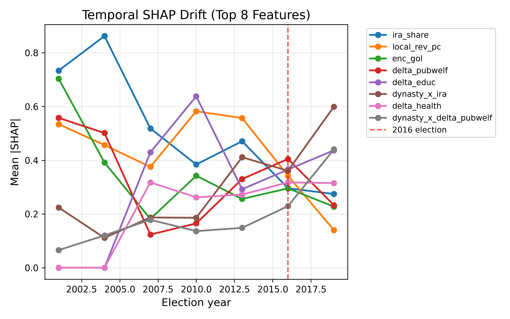
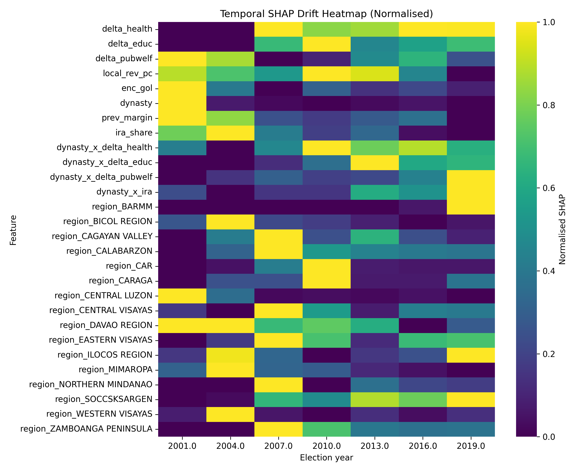
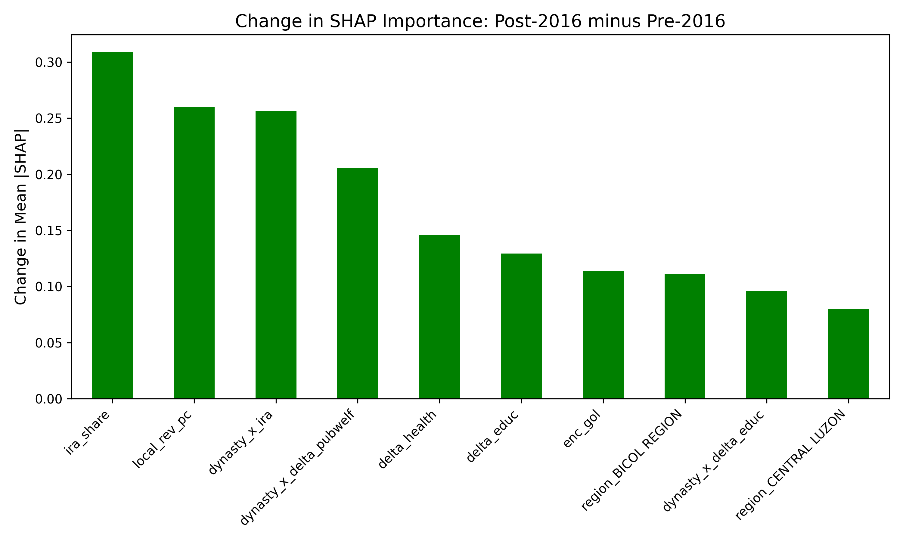
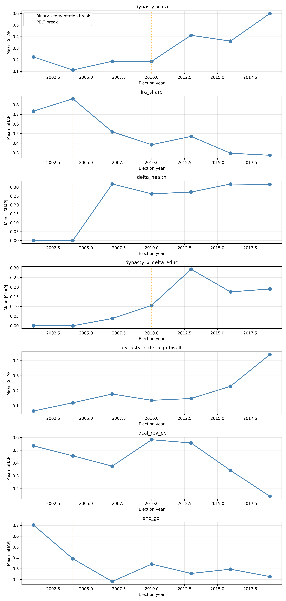

# Temporal SHAP Drift: Diagnosing Regime Shifts in Philippine Gubernatorial Elections (1992–2022)

[](https://www.python.org/downloads/)
[](https://opensource.org/licenses/MIT)

This repository contains the dataset, results, and visualization assets for the research paper: **"Temporal SHAP Drift: Diagnosing Regime Shifts in Philippine Gubernatorial Elections (1992–2022)"**.

The project introduces **Temporal SHAP Drift**, a machine learning diagnostic framework that tracks the evolution of SHAP (SHapley Additive exPlanations) feature importance across time. Instead of treating predictive instability as a model failure, this methodology uses expanding-window validation to detect and interpret structural breaks (regime shifts) in non-stationary political environments.

## 📊 Key Findings & Visualizations

The analysis reveals a substantial reordering of electoral incentives following the 2016 national political transition in the Philippines, shifting from programmatic fiscal accountability toward dynastic clientelism.

### 1. The Diagnostic Signal: Predictive Instability
Model accuracy fluctuates around random chance until peaking at the 2016 transition, indicating a fundamental shift in the underlying electoral logic that traditional, static models fail to capture.


### 2. Temporal SHAP Drift (Top Features)
This line plot tracks the mean absolute SHAP value for key predictors over time. Notice the dramatic post-2016 spike in the importance of dynastic interaction terms (`dynasty_x_ira`, `dynasty_x_delta_pubwelf`) and the simultaneous collapse of standard fiscal indicators (`ira_share`, `local_rev_pc`).



### 3. Structural Break Heatmap
A normalized heatmap of all feature importances across election cycles. The visual break between 2013 and 2016 is evident, showing a clear regime shift in subnational political behavior.



### 4. Quantifying the Regime Shift
A direct comparison of feature importance before and after the 2016 election, highlighting the percentage change in predictive power for each variable.



### 5. Change Point Detection
Algorithmic detection (Binary Segmentation and PELT) applied to the time series of SHAP values to statistically isolate the structural breaks in the dataset.



---

## 📂 Repository Structure: `data/` Directory

The `data/` directory contains all raw inputs, processed panels, and generated outputs required to reproduce the study's findings.

### Raw & Processed Datasets
*   `full_panel_all_sectors.csv`: The primary, cleaned panel dataset combining 30 years of fiscal and electoral data.
*   `fiscal+electoral_data_July 2025.xlsx`: Master integration of financial metrics and election outcomes.
*   `election_data.xlsx` / `fiscal_data.xlsx`: Raw, disaggregated source files from the Philippine Local Government Interactive Dataset.
*   `2024_T1_1.xlsx` / `2025_T1_1.xlsx`: Supplementary time-series data chunks.

### Tabular Results
*   `temporal_shap_drift.csv`: The core output file containing the computed mean |SHAP| values for every feature across every tested election year.
*   `pre_post_summary.csv`: Aggregated comparison metrics detailing the percentage change and confidence intervals for features pre- and post-2016.
*   `change_point_summary.csv`: Output from the `ruptures` library detailing the identified structural break years per feature.
*   `shap_drift_stats.csv`: General descriptive statistics of the SHAP distributions.

### Additional Visualizations
*   `shap_drift_faceted.png`: Individual, faceted trend lines for detailed feature inspection.
*   `shap_drift_heatmap.png`: The raw (non-normalized) heatmap of feature importance.
*   `shap_drift_relative.png`: Feature importance scaled relative to baseline years.
*   `shap_pre_post_comparison.png`: Alternative bar-chart representation of the pre/post-2016 shift.

---

## 💻 Setup & Usage

To reproduce the environment and regenerate the visualizations, ensure you have a standard Python data science stack installed (`pandas`, `xgboost`, `shap`, `ruptures`, `matplotlib`, `seaborn`). 

Assuming a Linux/Debian-based environment (e.g., Pop!_OS or Ubuntu):

1. **Activate your virtual environment:**
```bash
   source venv/bin/activate

    Navigate to the project directory:

Bash

   cd ~/Documents/Research/temporal-SHAP-drift/

    (Add instructions here for executing your specific Python scripts, e.g., python src/rolling_cv.py or python src/shap_plots.py)
```
    
📝 Citation

If you utilize this methodological framework, dataset, or code in your research, please cite the paper:

    Lumingkit, J. J. J. (2026). Temporal SHAP Drift: Diagnosing Regime Shifts in Philippine Gubernatorial Elections (1992–2022). Mindanao State University – Iligan Institute of Technology.